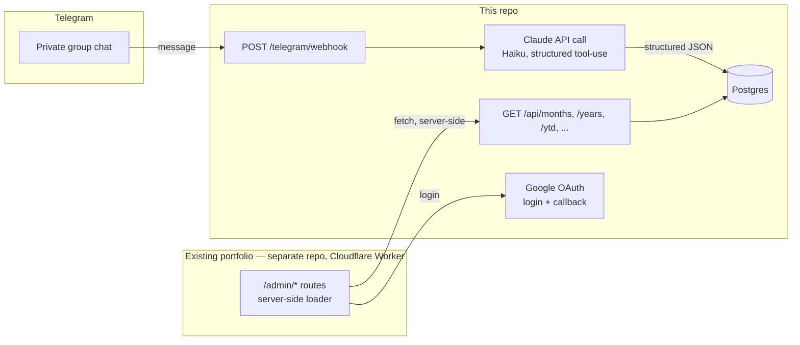

# Finance tracker backend — kickoff doc

> **Portable, self-contained.** Written inside the `personal-portfolio` repo
> (alongside [finance-tracker.md](finance-tracker.md),
> [finance-frontend.md](finance-frontend.md), and
> [finance-tracker-ledger.md](finance-tracker-ledger.md)), but meant to be
> copied into the **new backend repo** as its starting doc — drop it in as
> `docs/kickoff.md` or similar and treat it as that repo's source of truth
> from then on. It's a snapshot at hand-off time, not a live sync: once
> copied, edit the copy, not this one. Everything you need to start Phase 0
> without the portfolio repo open in another tab is inlined below — no
> links back to the other three docs' internals, only plain mentions of
> where the frontend half lives for context.
>
> Status: **investigation done, Phase 0 not started.** This already went
> through one adversarial-review pass in the source repo — real gaps were
> found and fixed (Claude could loop on its own confirmation messages; the
> schema had no currency field despite ARS/USD being a stated requirement;
> corrections were wrongly deferred as optional), and every either-way
> decision below was asked, not assumed. Expect this doc itself to keep
> changing once Phase 0 starts turning assumptions into real code — that's
> normal, not a sign the planning was wrong.

---

## 1. What this is

A private, two-person household finance tracker for you and your
girlfriend. The point of building it is **learning** — Python, FastAPI,
SQL, and the Claude API / prompt engineering — not shipping the fastest
possible MVP. The roadmap in §8 is paced accordingly: each phase ends with
something real running before the next one starts.

**Explicitly a secondary goal is day-to-day usefulness** — if the learning
goal and the "actually useful" goal ever pull in different directions
(e.g. a quick hack vs. the "proper" way), default to whichever one you're
trying to practice, since that's the reason this project exists.

The read side is a `/admin` section bolted onto an existing, unrelated
personal portfolio site (a Cloudflare Workers + React Router app, in a
different, public repo). That frontend talks to **this** backend over
plain HTTPS, server-side (its route loaders `fetch()` this API — never
from the browser, so there's no CORS or CSP concern on either side). This
backend repo owns none of that frontend code; the contract between them
is just the endpoint list in §6.

### Decided already

| Decision            | Choice                                              | Why                                                                                                                                                                                                                                 |
| ------------------- | --------------------------------------------------- | ----------------------------------------------------------------------------------------------------------------------------------------------------------------------------------------------------------------------------------- |
| Messaging channel   | **Telegram**, not WhatsApp                          | Telegram's Bot API is official, free, and reads group messages natively. WhatsApp's official Cloud API doesn't reliably support reading group chats — only unofficial, ToS-violating libraries do (§3.1).                           |
| Hosting budget      | **Free tier only**, for now                         | Achievable end-to-end (§7). Trade-off is cold-start latency after idle — fine for a tool checked a few times a month.                                                                                                               |
| Admin login         | **Google sign-in**, restricted to two emails        | Chosen over a shared password once the stakes changed from "public CV contact form" to "real financial data" — and a password already leaked once via screenshot in an unrelated project (§5). No password exists anywhere to leak. |
| Telegram group      | **Dedicated group**, expenses only                  | Every message can be assumed expense-shaped, which is what keeps the parsing prompt and guardrails simple (§3.4).                                                                                                                   |
| USD reference rate  | **Blue/informal rate**                              | More representative of real day-to-day purchasing power in Argentina than the oficial rate; captured per-transaction (§3.5) so the choice doesn't need revisiting for historical data.                                              |
| Receipt granularity | **One categorized total per receipt**, not itemized | Simpler extraction; reuses the same `record_expense` tool as text messages (§3.6) — no separate line-items schema.                                                                                                                  |

### Non-goals for v1

- Budgets, alerts, forecasting.
- Debt-settling / "who owes whom" splitting (Splitwise-style). This is a
  shared-pot tracker, not a splitter — revisit only if that assumption
  turns out to be wrong in practice.
- Recurring-expense automation (rent/expensas gets typed in by hand each
  month for v1). Cheap fast-follow once the core loop is proven — see §8.
- Any write endpoint the frontend calls directly — corrections happen via
  Telegram (§3.3), not a form on the site; the frontend is genuinely
  read-only. **One narrow exception**: `POST
/api/months/{yyyy-mm}/analysis/regenerate` (§6) backs a "Regenerate"
  button on the frontend's monthly view — it only recomputes a derived
  summary from data that already exists, it can't create or alter an
  expense, so it isn't a workaround for the frontend editing financial
  records.
- Migrating the existing portfolio's CV content into this backend — that
  data stays exactly where it is (static JSON in the portfolio repo,
  edge-cached, zero external calls). This is a fully separate system that
  happens to share a Cloudflare account and, optionally, a subdomain.

---

## 2. Architecture at a glance



Two independent deployables, talking only over HTTP(S) — nothing requires
them to share a repo, language, or deploy pipeline:

1. **This repo** — Python + FastAPI, its own host, its own Postgres
   database.
2. **The existing portfolio repo** (unchanged deployment model otherwise)
   gains a handful of `/admin/*` routes whose loaders run server-side in a
   Cloudflare Worker and call this backend's API.

---

## 3. Ingestion: Telegram + Claude

### 3.1 Why not WhatsApp

WhatsApp has two integration paths, and neither fits "read a real group
chat for free, safely":

- **Official WhatsApp Business Cloud API (Meta)** — ToS-compliant, has a
  free tier for the message volumes this needs, but is built around 1:1
  business conversations. Reliable, supported reading of **group**
  messages isn't part of the official product. You could still use it as a
  bot both of you DM directly — no group feel, but fully legitimate.
- **Unofficial automation (e.g. Baileys, whatsapp-web.js)** — drives a real
  WhatsApp Web session programmatically, so it _can_ read an actual group.
  But it violates WhatsApp's Terms of Service, risks the phone number
  being banned, and needs an always-on process holding a live session —
  not something you can run as a simple serverless function on a free
  tier.

**Telegram sidesteps the whole problem.** Its Bot API is official, free,
has no group restriction, and a bot can read every message in a group it's
added to (after disabling "privacy mode" for that bot in @BotFather — off
by default, one settings toggle). This is the only path that gets you an
actual shared group chat without ToS risk.

### 3.2 Ingestion flow

1. Create a bot via [@BotFather](https://t.me/BotFather) (free, instant),
   disable privacy mode so it sees all group messages, not just
   `/commands`.
2. Add the bot to a private group with just the two of you.
3. Point the bot's webhook at `POST /telegram/webhook` on this backend, set
   with Telegram's `setWebhook` call including a `secret_token` — reject
   any request whose header doesn't match, so the endpoint isn't just
   security-through-obscurity.
4. Forward the raw message text to Claude with a system prompt describing
   the expense schema, using **Claude's tool-use / forced-schema output**
   (define a `record_expense` tool with a strict JSON schema — amount,
   category, description, paid_by, occurred_on) rather than asking for
   free-text JSON and hoping it parses. This is the reliable way to get
   structured output from a model and is worth learning as a pattern
   regardless of this project.
5. Model recommendation: **Haiku-class** (`claude-haiku-4-5-20251001` as of
   this doc). This is simple structured extraction from a short message —
   Haiku is the cost-optimized tier for exactly this kind of task; reach
   for a bigger model only if extraction accuracy turns out to need it.
6. Validate the model's output against the same schema server-side (never
   trust a model's output blindly, even with tool-use), then write to
   Postgres — keep the **original raw message text** alongside the parsed
   row for audit/debugging when the model gets something wrong.

> **Pricing note:** don't trust this doc's memory of exact per-token
> prices — model lineups and pricing shift. When you get to Phase 4, pull
> current model IDs and pricing before committing to one (Claude Code has
> a `claude-api` skill that does this, if you're using it for this repo
> too). At the message volume a two-person household generates (a handful
> of short messages a day), the realistic cost is low enough that it's a
> rounding error either way — but confirm that with real numbers, not this
> paragraph.

### 3.3 Corrections and confirmation — not optional, not deferred

Without a reply, a misparse is invisible until you next open the
dashboard, at which point you've lost the context to fix it confidently.
For "record it right there at the market" to actually work, the loop has
to close at the point of entry:

1. Every parsed message gets a bot reply in the group — e.g. `✅ Groceries
— $5,000 ARS`. This is the confirmation that closes the loop and the
   only realistic way you'll catch a bad parse when it's still cheap to
   fix.
2. If Claude's extraction confidence is low (ambiguous amount, no clear
   category), the bot should **ask a clarifying question in the group
   instead of silently writing a guess**. A wrong-but-confident write is
   worse than no write, because it corrupts a total you won't think to
   double-check.
3. `/undo` (delete the last entry) and `/edit last field=value` ship
   **alongside Claude integration in Phase 4**, not after it. Given
   free-text parsing of your specific phrasing won't be reliably accurate
   from message one, corrections aren't an edge case — they're part of the
   core loop.
4. Direct SQL against the database still works for anything the commands
   don't cover — that's a feature of the plan (SQL practice), not a gap.
5. When a correction happens, keep **both** the original AI-parsed value
   and the corrected value (e.g. a `corrections` table, or an
   `original_json` column on the expense row) rather than overwriting
   silently. That's a dataset of "where the prompt got it wrong" for free
   — exactly what you'd want if you're iterating on the extraction prompt
   as a learning exercise.

### 3.4 Guardrails: keeping Claude narrowly scoped to expenses

- **Restrict Claude's output to tool-calls only, never freeform text
  relayed back to the user.** Define a small fixed set of tools —
  `record_expense` (used for both text messages and receipt photos, see
  §3.6), `no_action` (message isn't an expense), `request_clarification`
  (ambiguous, needs a human reply) — and never let the model's own
  free-text generation reach the group or the database directly. This is
  the actual prompt-injection defense: even if a message tries to
  manipulate the model ("ignore previous instructions and..."), the worst
  case is it calls the wrong _tool_ with the wrong _arguments_ — it can't
  produce arbitrary text, arbitrary actions, or arbitrary data shapes,
  because the schema is a hard boundary on what can ever be written.
- **System prompt states the model's job as narrowly as the tools do**:
  "you extract expenses from messages in a private household finance
  group; anything that isn't an expense or a known command gets
  `no_action`; you have no other function." Don't give it room to be a
  general assistant.
- **A real bug to design around, not just a risk to note**: the bot's own
  confirmation replies (§3.3) land back in the same group as new
  messages. If the webhook doesn't filter out messages sent by the bot
  itself (Telegram's `message.from.is_bot`, or comparing the sender ID to
  the bot's own), you get a feedback loop — the bot's "✅ Groceries —
  $5,000" reply gets reprocessed as if it were a new message, potentially
  double-recording or spiraling. **Filter out the bot's own messages
  before they ever reach Claude.** This is easy to miss and easy to test
  for once you know to look.
- **A daily cap on Claude calls from the webhook** (e.g. a simple counter,
  reset daily) as a cost/abuse safety net — cheap insurance against the
  above loop (or any other bug) turning into a real bill, on top of
  fixing the loop itself.
- **Dedicated group, expenses only** (§1). Every message can be assumed
  expense-shaped, which is exactly what keeps the guardrails above
  simple — the prompt doesn't need to separate "is this an expense" from
  "what expense is this," just the latter. If this ever changes to a
  shared everyday-chat group, revisit this section: Claude would then
  have to reliably tell "5000 on groceries" apart from ordinary
  conversation, which is a harder, noisier problem than what's designed
  here.

### 3.5 Currency: ARS native, USD-convertible

Two distinct needs, both handled by the same design:

1. **An expense that's natively in USD** (common in Argentina — some
   prices are quoted or paid in USD directly) needs its own `currency`
   field, not an implicit "everything is ARS" assumption. Add `currency`
   (`ARS` | `USD`) to both the extraction tool schema and the `expenses`
   table.
2. **Converting historical ARS totals to a USD-equivalent for reporting**
   — genuinely important in Argentina specifically, since ARS totals a
   few months apart aren't meaningfully comparable without adjusting for
   the exchange rate. The trap to avoid: converting an old ARS amount
   using _today's_ rate gives a misleading number. Store the **exchange
   rate at the time of the transaction** (`ars_usd_rate_at_entry`, looked
   up from a free FX API at ingestion time and cached) so historical
   USD-equivalent figures stay accurate without needing to reconstruct
   rates later. Month/year responses then return both a native-currency
   total and a USD-equivalent total.
3. **The blue/informal rate**, not oficial or MEP — chosen as more
   representative of real day-to-day purchasing power in Argentina. Both
   `dolarapi.com` and `bluelytics.com.ar` expose a `blue`-specific
   endpoint for free with no API key needed for basic use; confirm
   current terms at **Phase 4**, when ingestion actually starts calling
   it — nothing in Phase 1 depends on the API being live, only on the
   column existing. Since the rate is captured per-transaction at
   ingestion time (point 2 above), this choice never needs revisiting for
   historical data even if a different rate seems more useful later —
   only new entries would use a changed methodology.

### 3.6 Receipt photos (fast-follow, not v1.0)

Claude has vision input, and "itemize this receipt photo" is a
well-suited, mainstream use of it. Telegram bots can receive photo
messages natively (the Bot API's `photo` message type, downloaded via
`getFile`) — no platform blocker either.

It's deliberately **not** bundled into Phase 4 (text parsing is already a
full phase on its own), but it reuses the exact same webhook → Claude →
Postgres pipeline, just swapping the input type from text to image — so
it's a natural "Phase 4B" (§8) right after text parsing is solid, not a
someday/maybe. Vision calls cost more per request than text-only, but at
"a few receipts a week" volume that stays well within "check the real
number, don't worry about it" territory.

**One categorized total per receipt**, not itemized per product. This is
meaningfully simpler than it could have been — it means a receipt photo
calls the exact same `record_expense` tool a text message does (§3.4),
just with an image as the input instead of typed text. No separate
line-items schema, no per-product category-splitting logic to get right.
If finer-grained category data ever turns out to matter, itemization is a
well-scoped later addition, not a redesign.

### 3.7 Trips / vacations (future section, designed now)

Worth a real design sketch now even though building it stays deferred,
since it's a schema decision that's much cheaper to bake in early than
retrofit:

- A `trips` table (`id`, `name`, `start_date`, `end_date`) and a nullable
  `trip_id` on `expenses`. `NULL` = ordinary monthly expense; tagged =
  counted toward that trip instead.
- Also add `status` (`planned` | `active` | `completed`) and a nullable
  `budget` column to `trips` now — the frontend's trip-**planning** UI is
  a deliberate wait-and-see fast-follow (build it once a couple of trips
  have been tracked retrospectively, not on the assumption planning is
  wanted), but the columns are cheap to bake into the schema today
  regardless.
- Month/year views **exclude** trip-tagged expenses from the normal
  running totals by default (a vacation shouldn't make it look like you
  blew the monthly grocery budget) — with trips shown as their own
  separate view.
- For low-friction tagging during the trip itself, prefer a **stateful
  "trip mode"** over remembering to prefix every message: `/trip start
"Bariloche"` sets an active-trip flag the backend checks on every incoming
  message until `/trip end` is sent, so nothing needs to be said twice.
  Requires its own endpoints (`GET /api/trips`, `GET /api/trips/{id}`) —
  not in the v1 endpoint list in §6, added there as future/non-v1.

---

## 4. Project structure

Standard FastAPI project layout, nothing exotic:

```text
finance-tracker-backend/
├── app/
│   ├── main.py              # FastAPI() app, router includes
│   ├── routers/
│   │   ├── auth.py
│   │   ├── telegram.py      # webhook receiver
│   │   └── expenses.py      # month/year/ytd/categories/analysis
│   ├── models.py            # SQLAlchemy models
│   ├── schemas.py           # Pydantic request/response schemas
│   ├── claude.py            # Claude API call + tool-use schema
│   ├── db.py                # engine/session setup
│   └── config.py            # env-based settings (pydantic-settings)
├── alembic/                 # migrations
├── tests/                   # pytest
├── pyproject.toml
└── Dockerfile               # most free hosts want a container or a
                              # buildpack-detectable app; a Dockerfile keeps
                              # you portable across providers
```

Tooling choices, matching the learning goal:

- **uv** or **poetry** for dependency management (either is fine; `uv` is
  newer and fast, worth trying if you haven't).
- **SQLAlchemy 2.x + Alembic** for models/migrations — but **write the
  initial schema as raw SQL DDL first, by hand** (Phase 1, §8), then
  express the same schema in SQLAlchemy models. This is deliberate: the
  DDL is yours to write as the SQL-learning exercise this project exists
  for — don't let a generated migration or an ORM `create_all()` be the
  first place the schema gets written down.
- **pytest** for tests.
- **pydantic-settings** for config (`DATABASE_URL`, `CLAUDE_API_KEY`,
  `TELEGRAM_BOT_TOKEN`, `TELEGRAM_WEBHOOK_SECRET`) — never commit real
  values, standard `.env`-not-in-git discipline.

---

## 5. Auth: Google sign-in, restricted to two emails

Chosen over a shared password specifically because this gates real
financial data rather than something lower-stakes — and because a
password already leaked once via screenshot in an unrelated project. No
password anywhere means nothing to leak.

- Standard OAuth 2.0 "Sign in with Google" flow: this backend redirects to
  Google's consent screen (with a `state` parameter, checked again on the
  callback — standard CSRF protection for the OAuth dance itself, cheap to
  include and easy to forget); Google calls back with an auth code; the
  backend exchanges it for the visitor's verified email address.
- **The entire access control is an allowlist of exactly two email
  addresses.** Anyone with any Google account can complete the OAuth flow
  itself — the allowlist check happens _after_, before a session is ever
  issued. Reject there, not later.
- On success, issue a short-lived session token (JWT, HS256, shared
  secret) — Google only needs to prove identity once; it doesn't stay
  involved in ordinary API calls afterward.
- **The part this doc used to gloss over: how does the frontend's Worker
  ever see this JWT, given the OAuth dance above happens on _this_
  backend's domain, not the frontend's?** The mechanism is a cookie set
  with `Domain=.<registrable-domain>` — the shared parent of both the
  frontend's domain and this backend's subdomain, consistent with §7's
  "subdomain of the existing domain" plan — plus `HttpOnly`, `Secure`,
  `SameSite=Lax`. Subdomains of the same registrable domain are
  same-site, so a `Lax` cookie set here is still attached by the browser
  on ordinary navigation to the frontend's domain — no token-in-redirect
  handoff needed, the browser does that work for free. **This only holds
  because both services share a registrable domain.** If the backend ever
  ends up hosted somewhere that isn't a subdomain of the frontend's own
  domain (a real risk if a free-tier host forces its own domain), this
  whole mechanism breaks and needs replacing with an explicit
  token-in-redirect-then-frontend-sets-its-own-cookie handoff instead.
- The frontend's Worker then verifies the JWT's signature locally (same
  HS256 secret, no network round-trip) before calling this API for data —
  cheap, and keeps the admin-gate check fast on that side. **That signing
  secret is shared state across two separately-deployed repos** —
  rotating it means updating it in both places in the same window, or the
  two sides silently disagree about which sessions are valid. Worth a
  one-line cross-reference note in both repos' deploy docs once Phase 5
  actually sets this up, so future-you doesn't rotate one side and get a
  confusing wall of 401s.
- Apply the auth check as a **default-deny dependency on the whole
  router**, with an explicit allowlist for the few routes that must stay
  open (`/telegram/webhook`, `/api/auth/google/login`,
  `/api/auth/google/callback`, `/api/health`) — rather than opting
  individual routes into auth one at a time, where forgetting one is a
  real and common way FastAPI apps leak data. This matters regardless of
  the auth mechanism, but especially once there's no password acting as
  an obvious "this route needs protecting" reminder.

No password to hash, no login-brute-force surface, no
`passlib`/`bcrypt` dependency. Basic rate limiting on the callback
endpoint is still sensible general hygiene (abuse/cost protection).

> **Worth knowing as an alternative implementation, not a different
> decision:** Cloudflare Access (Zero Trust, free for small user counts)
> can enforce this exact "restrict to two emails" outcome with zero custom
> OAuth code, using Google (or several other providers, or email
> one-time-PIN) as the identity check. Same result, less code to write
> yourself — worth comparing at Phase 5 purely as a
> build-it-yourself-for-the-learning vs. use-the-managed-thing trade-off.

**The real write-boundary is "who's in the Telegram group,"** not the
login above. App-level auth controls who can **view** the dashboard, but
who can **write** an expense is entirely determined by Telegram group
membership — anyone in that group can post a message the bot will parse
and record. There's no separate "are you allowed to submit expenses"
check by design; the group's membership _is_ that check. Practically:
don't post the group's invite link anywhere public, and don't forward it.
Lightweight, but real, and worth knowing it's the boundary actually doing
the work on the write side.

---

## 6. The API contract (what the frontend needs)

The frontend (a separate, existing portfolio repo) has three read views —
month, year/YTD, and a vacation/trips section — plus one derived-summary
write exception. Every `GET` below returns **pre-aggregated** JSON: sums
and groupings computed in SQL/Python server-side, not raw rows for the
frontend to crunch. Month/year responses include both a native-currency
total and a USD-equivalent total (§3.5).

| Method + path                                    | Purpose                                                                                                                        | Auth                           |
| ------------------------------------------------ | ------------------------------------------------------------------------------------------------------------------------------ | ------------------------------ |
| `POST /telegram/webhook`                         | Receives Telegram updates                                                                                                      | Telegram `secret_token` header |
| `GET /api/auth/google/login`                     | Redirects to Google's consent screen                                                                                           | none (this _is_ the login)     |
| `GET /api/auth/google/callback`                  | Verifies identity against the 2-email allowlist, issues session JWT                                                            | none (verifies itself)         |
| `GET /api/months/{yyyy-mm}`                      | Total, category breakdown, transaction list for one month                                                                      | session                        |
| `GET /api/years/{yyyy}`                          | Total, per-month totals, category breakdown for a year                                                                         | session                        |
| `GET /api/ytd`                                   | Same shape as `/years`, bounded at today                                                                                       | session                        |
| `GET /api/categories`                            | Category list (for chart legends/filters)                                                                                      | session                        |
| `GET /api/months/{yyyy-mm}/analysis`             | Cached Claude-written monthly analysis; generates + caches on first request (Phase 4C)                                         | session                        |
| `POST /api/months/{yyyy-mm}/analysis/regenerate` | Forces a fresh analysis, overwriting the cached copy — backs the frontend's "Regenerate" button; only valid for elapsed months | session                        |
| `GET /api/health`                                | Liveness check for the hosting provider                                                                                        | none                           |

**Future, not v1** (§3.7): `GET /api/trips`, `GET /api/trips/{id}` — same
shape as the month/year endpoints, scoped to a trip instead of a calendar
period.

**Monthly analysis, briefly** (full frontend UX lives in the frontend
repo, not duplicated here): generated **once per elapsed month**, cached
server-side in a `monthly_analyses` table (month, text, generated_at) —
never regenerated live per page view or per chart interaction, since
that'd mean a fresh Claude call every time the dashboard is opened.
Current, still-incomplete months don't get an analysis at all (a partial
month's summary would be misleading). Use a **Sonnet-class** model here,
not the Haiku-class one from ingestion (§3.2) — this is a generative
"write a paragraph of insight" task, not structured extraction, and
benefits from the stronger tier; still cheap at "once a month," but not
the same near-zero-cost category as per-message parsing.

### 6.1 Wire format, and concrete example payloads

**Every response is camelCase**, matching every other JSON asset already
in the frontend repo — **not** the snake_case FastAPI/Pydantic emits by
default. Configure response models with an alias generator
(`model_config = ConfigDict(alias_generator=to_camel, populate_by_name=True)`
plus `response_model_by_alias=True` on the route, or per-field
`Field(alias=...)`) so the JSON on the wire is camelCase even though the
Python code underneath stays snake_case. Skipping this is the single most
likely reason integration (Phase 6) breaks on first contact even though
both sides tested clean in isolation.

The frontend already has a runtime Zod schema for every shape below
(`app/data/admin-schema.ts` in the portfolio repo) plus hand-written
fixtures that satisfy it (`app/data/admin-fixtures.ts`) — built
specifically so this backend has a concrete target to implement against
while the two repos are worked on in parallel, not just prose. The JSON
below is that same contract, inlined here since this doc is meant to
travel without the other repo open in a tab. A few notes that apply
across all of them:

- Every money figure is `{ ars: number, usd: number }` — **both** fields,
  always, per §3.5. Never send just one currency and expect the frontend
  to compute the other.
- Fields that can be legitimately absent (no previous month, no trip) are
  **present and `null`**, not omitted — Pydantic includes every field by
  default, and the frontend schema uses `.nullable()` rather than
  `.optional()` to match that.
- `GET /api/months/{yyyy-mm}`:

  ```json
  {
    "month": "2026-08",
    "total": { "ars": 850280, "usd": 621 },
    "previousMonthTotal": { "ars": 790000, "usd": 577 },
    "deltaPercent": 7.6,
    "categories": [
      {
        "categoryId": "groceries",
        "categoryName": "Groceries",
        "total": { "ars": 320000, "usd": 234 },
        "transactionCount": 3
      },
      {
        "categoryId": "rent_expensas",
        "categoryName": "Rent / Expensas",
        "total": { "ars": 250000, "usd": 182 },
        "transactionCount": 1
      }
    ],
    "transactions": [
      {
        "id": "tx_001",
        "occurredOn": "2026-08-02",
        "categoryId": "groceries",
        "categoryName": "Groceries",
        "description": "Coto — weekly shop",
        "amount": { "ars": 120000, "usd": 88 },
        "currency": "ARS",
        "paidBy": "You",
        "tripId": null
      },
      {
        "id": "tx_010",
        "occurredOn": "2026-08-15",
        "categoryId": "other",
        "categoryName": "Other",
        "description": "Streaming subscription",
        "amount": { "ars": 60280, "usd": 44 },
        "currency": "USD",
        "paidBy": "You",
        "tripId": null
      }
    ]
  }
  ```

  (`categories` and `transactions` trimmed to two entries each above for
  length — a real response lists every category with any spend that month
  and every individual transaction, not just the top few.)

- `GET /api/years/{yyyy}` and `GET /api/ytd` share this exact shape —
  `/ytd` just has fewer entries in `monthlyTotals`:

  ```json
  {
    "year": 2025,
    "total": { "ars": 9550000, "usd": 7220 },
    "monthlyTotals": [
      { "month": "2025-01", "total": { "ars": 700000, "usd": 610 } },
      { "month": "2025-02", "total": { "ars": 720000, "usd": 615 } }
    ],
    "categories": [
      {
        "categoryId": "groceries",
        "categoryName": "Groceries",
        "total": { "ars": 3600000, "usd": 2700 },
        "transactionCount": 36
      }
    ]
  }
  ```

- `GET /api/categories`:

  ```json
  [
    { "id": "groceries", "name": "Groceries" },
    { "id": "rent_expensas", "name": "Rent / Expensas" },
    { "id": "transport", "name": "Transport" }
  ]
  ```

- `GET /api/months/{yyyy-mm}/analysis` — two distinct shapes depending on
  whether the month has elapsed, distinguished by `status` so the
  frontend can't accidentally read `.analysis` off a month that was never
  generated:

  ```json
  {
    "status": "ready",
    "month": "2026-08",
    "analysis": "August spending came in about 8% above July...",
    "generatedAt": "2026-09-01T09:14:00Z"
  }
  ```

  ```json
  {
    "status": "not_available",
    "month": "2026-09",
    "reason": "month_in_progress"
  }
  ```

  `POST /api/months/{yyyy-mm}/analysis/regenerate` returns the same
  `"ready"` shape on success.

---

## 7. Costs (investigation, not a quote)

Every number below is a **provider's advertised tier as of this doc's
writing** — free-tier terms change often. Re-verify at signup, and treat
this table as "which category of thing to look at," not a guarantee.

| Piece           | Option                                | Notes                                                                                                                                                                                                                                                                                                              |
| --------------- | ------------------------------------- | ------------------------------------------------------------------------------------------------------------------------------------------------------------------------------------------------------------------------------------------------------------------------------------------------------------------ |
| Messaging       | Telegram Bot API                      | Free, no tier to worry about.                                                                                                                                                                                                                                                                                      |
| AI parsing      | Claude API (Haiku-class)              | Pay-per-token, but at "a few short messages a day" volume this is negligible — get real numbers before Phase 4.                                                                                                                                                                                                    |
| Backend hosting | Render / Fly.io free web-service tier | Free tiers on these exist but commonly **spin down after ~15 min idle**, adding a few seconds of cold-start on the next request. Fine for a tool checked occasionally; confirm current terms, since these have shifted before (e.g. Railway moved away from an indefinite free tier to trial credit + paid plans). |
| Database        | Neon or Supabase free Postgres        | Both offer a genuinely free tier at this scale (serverless Postgres, scale-to-zero / pause-on-idle). Either is a reasonable, real-SQL choice — Neon leans more "just Postgres," Supabase bundles extras (auth, storage) you won't need here.                                                                       |
| Domain          | Subdomain of the existing domain      | Free — a subdomain of the portfolio's existing domain costs nothing extra and optionally sits behind Cloudflare's proxy for free TLS + basic protection in front of this backend.                                                                                                                                  |

**Realistic total: $0/month**, with cold-start latency after idle as the
one real trade-off — a non-issue for a dashboard checked a handful of
times a month.

---

## 8. Phased roadmap

Each phase should end with something concretely running before starting
the next one — that's the point, given the learning goal.

- **Phase 0 — Scaffolding.** New repo, FastAPI "hello world," deployed to
  the chosen free host, publicly reachable. Get the deploy loop working
  before any real logic exists.
- **Phase 1 — Database & schema.** Provision Postgres (Neon/Supabase).
  Write the schema as raw SQL DDL first (including `currency` and
  `ars_usd_rate_at_entry` from §3.5, and a normalized `categories` table
  with `expenses.category_id` as an FK per §9's taxonomy note — cheap now,
  a migration later), query
  it by hand via `psql` or the provider's console, _then_ express the
  same schema in SQLAlchemy models + an Alembic migration, so the ORM
  layer never hides what the SQL actually does. Also set up a simple
  periodic export (even a monthly `pg_dump` you email yourself) —
  free-tier DB providers often make no backup guarantee, and this is real
  financial history, not disposable data.
- **Phase 2 — Core read endpoints.** Implement `/api/months`, `/api/years`,
  `/api/ytd`, `/api/categories` against seeded fake data. Use FastAPI's
  free `/docs` (OpenAPI) as you go. Write pytest tests alongside. Store
  and bucket dates in Argentina's timezone (ART, UTC-3), not the server's
  default — a message sent late at night is the kind of thing that
  silently lands in the wrong month otherwise.
- **Phase 3 — Telegram plumbing.** Create the bot, wire the webhook, and
  for this phase just **log the raw incoming message** — no Claude yet.
  Confirm the full chain (group → webhook → backend log) works before
  adding AI on top of it. For local development before a real backend is
  deployed, use `ngrok`/Cloudflare Tunnel to expose localhost, or
  Telegram's long-polling mode instead of a webhook — either avoids
  needing a public URL just to iterate.
- **Phase 4 — Claude integration.** Add the tool-use call (§3.4's
  guardrails — narrow tool set, bot-self-message filtering, daily call
  cap — are part of this phase, not a follow-up), test against a batch of
  real example messages the two of you might actually send **in the way
  you actually talk** (Argentine Spanish, shorthand like "15 lucas"), and
  iterate on the prompt/schema until extraction is reliably accurate.
  Ship the confirmation reply and `/undo`/`/edit` (§3.3) in this same
  phase — they're part of the core loop, not an add-on.
- **Phase 4B — Receipt photos.** Fast-follow once text parsing is solid
  (§3.6): same pipeline and the same `record_expense` tool, photo input
  instead of text — no separate line-items schema, per the decided
  one-total-per-receipt scope.
- **Phase 4C — Monthly Claude analysis endpoint.** `GET
/api/months/{yyyy-mm}/analysis` plus `POST .../regenerate` (§6), a
  `monthly_analyses` table (month, text, generated_at), generated once
  per elapsed month on first request and cached.
- **Phase 5 — Auth.** Google OAuth login restricted to your two emails,
  session issuance (§5) — no password to hash. Still worth basic rate
  limiting on the callback endpoint as general hygiene, even without a
  brute-forceable password behind it.
- **Phase 6 — Frontend integration.** Coordination point with the
  frontend repo: its `/admin/*` loaders start calling this API for real
  instead of local fixtures. No backend code changes expected here beyond
  fixing whatever the frontend's actual usage reveals.
- **Phase 7 — Hardening.** Remaining rate limiting (e.g. `slowapi`),
  confirm the webhook's secret-token check, basic logging/observability,
  put the backend behind the Cloudflare-proxied subdomain, and do a real
  cost check-in against §7's estimates.

**Stretch goals (explicitly deferred, not forgotten):** budgets/alerts,
recurring-expense automation, trips/vacations planning UI (§3.7 —
schema designed, UI not scheduled), a proactive monthly digest the bot
posts into the group instead of waiting to be asked ("you spent $X this
month, up/down Y% from last").

---

## 9. Smaller open items (deliberately deferred, not blocking)

- **Category taxonomy is a schema-shape decision, not just a naming one.**
  `GET /api/categories` (§6) already implies categories are a real,
  backend-owned dataset, not a hardcoded frontend list — which means the
  natural fit is a normalized `categories` table (`id`, `name`) with a
  `category_id` foreign key on `expenses`, not a free-text column or a
  `CHECK` constraint enum. A free-text field lets a typo ("Grocerys")
  silently fragment a category in every report without either of you
  noticing; a real table with an FK is exactly the kind of constraint
  this project's SQL-learning goal (§1) is for. Define the actual list
  together (groceries, rent/expensas, utilities, transport, etc.) and
  seed it as this table's rows in Phase 1.
- **Retention**: keep raw Telegram message text indefinitely alongside
  parsed rows? (Recommended: yes — cheap, and useful for debugging any
  low-confidence Claude parse.)
- **Who sent it**: Telegram gives you the sender's identity on every
  message for free (`message.from.id`/`username`) — just confirm the map
  from "Telegram user ID" to "you" / "your girlfriend" gets wired up for
  the `paid_by` field rather than assumed.
- **Inflation context, not really a "question" so much as a caveat to
  keep visible**: even with USD conversion, month-over-month ARS
  comparisons in Argentina can be misleading without it — a "we spent way
  more!" reaction to a plain ARS chart might just be inflation, not a
  real spending change. Worth surfacing the USD-equivalent total
  prominently in year-over-year views for exactly this reason, not just
  as an extra column.
- **Anthropic sees the message content**, same as any API call to any LLM
  provider — a non-issue for personal household data for most people, but
  worth naming plainly rather than leaving unsaid.

---

## 10. Next step

Pick Phase 0 when you're ready to start: a new repo, a FastAPI "hello
world," deployed and publicly reachable on whichever free host you land
on after a quick look at current terms. Everything past that point should
get its own, much more detailed, working session rather than more
planning.
