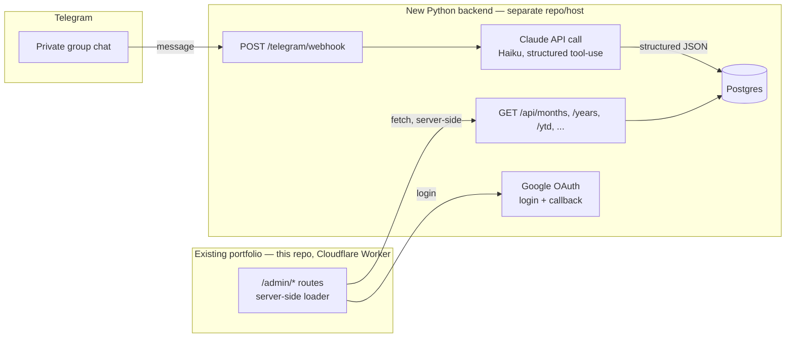

# Finance tracker — investigation & roadmap

> Status: **investigation, not started**. This is a planning doc, not a spec —
> expect it to change once Phase 0 starts turning assumptions into real code.
> Lives here (not `TECH-DEBT.md`) because it's a separate system with its own
> repo, hosting, and database — this file just documents how it connects to
> the CV site.
>
> **Revision note:** this version incorporates an adversarial review pass —
> real gaps were found (Claude could loop on its own confirmation messages;
> the schema had no currency field despite ARS/USD being a stated
> requirement; corrections were wrongly deferred as optional) and are fixed
> inline below, not just listed as findings. Four genuine either-way
> decisions came out of it too (Telegram group scope, admin login
> mechanism, USD reference rate, receipt granularity) — asked rather than
> assumed, and answered; see the "Decided already" table just below.
>
> See also: [finance-frontend.md](finance-frontend.md) (the `/admin`
> frontend plan, which added Phase 4C below) and
> [finance-tracker-ledger.md](finance-tracker-ledger.md) (running status +
> decision log across both halves of the project).

## 1. What this is

A private, two-person household finance tracker, bolted onto the existing CV
site as a read-only `/admin` section. The point of building it is **learning**
— Python, FastAPI, SQL, and Claude API / prompt engineering — not shipping
the fastest possible MVP. The roadmap below is paced accordingly: each phase
ends with something real running before the next one starts.

**Explicitly a secondary goal for you and your girlfriend to use day to day**
— if the learning goal and the "actually useful" goal ever pull in different
directions (e.g. a quick hack vs. the "proper" way), default to whichever one
you're trying to practice, since that's the reason this project exists.

### Decided already (from the kickoff conversation)

| Decision            | Choice                                              | Why                                                                                                                                                                                                                                                                                                                                                                  |
| ------------------- | --------------------------------------------------- | -------------------------------------------------------------------------------------------------------------------------------------------------------------------------------------------------------------------------------------------------------------------------------------------------------------------------------------------------------------------- |
| Messaging channel   | **Telegram**, not WhatsApp                          | Telegram's Bot API is official, free, and reads group messages natively. WhatsApp's official Cloud API doesn't reliably support reading group chats — only unofficial, ToS-violating libraries do (see §4.1).                                                                                                                                                        |
| CV data             | **Stays exactly as-is**                             | The current static-JSON, edge-cached setup (§9 of `AGENTS.md`) is deliberately tuned to be fast and free with zero external calls. Migrating it into a new backend would add latency, cost, and a new failure mode to a page that needs none of that. Finance is a fully separate system that happens to share your Cloudflare account and (optionally) a subdomain. |
| Hosting budget      | **Free tier only**, for now                         | Achievable end-to-end (§8). Trade-off is cold-start latency after idle — fine for a tool checked a few times a month.                                                                                                                                                                                                                                                |
| Admin login         | **Google sign-in**, restricted to your two emails   | Reconsidered from the original shared-password plan once the stakes changed from "public CV contact form" to "real financial data" — and this exact project already had a password leak once via screenshot (§6.5). No password exists anywhere to leak.                                                                                                             |
| Telegram group      | **Dedicated group**, expenses only                  | Every message can be assumed expense-shaped, which is what keeps the parsing prompt and guardrails simple (§4.4).                                                                                                                                                                                                                                                    |
| USD reference rate  | **Blue/informal rate**                              | More representative of real day-to-day purchasing power in Argentina than the oficial rate; captured per-transaction (§4.5) so the choice doesn't need revisiting for historical data.                                                                                                                                                                               |
| Receipt granularity | **One categorized total per receipt**, not itemized | Simpler extraction; reuses the same `record_expense` tool as text messages (§4.6) — no separate line-items schema.                                                                                                                                                                                                                                                   |

### Non-goals for v1

- Budgets, alerts, forecasting.
- Debt-settling / "who owes whom" splitting (Splitwise-style). This is a
  shared-pot tracker, not a splitter — revisit only if that assumption turns
  out to be wrong in practice.
- Recurring-expense automation (rent/expensas gets typed in by hand each
  month for v1). Cheap fast-follow once the core loop is proven — see §9.
- Any write UI in the frontend — corrections happen via Telegram (§4.3), not
  a form on the site. This keeps the frontend genuinely read-only, per your
  original spec. **One narrow exception**: a "Regenerate analysis" button
  on the monthly view ([finance-frontend.md](finance-frontend.md) §9) — it
  only recomputes a derived summary from data that already exists, can't
  create or alter an expense, and isn't a workaround for the frontend
  editing financial records.
- Migrating the CV's own data into this backend (see table above).

**No longer non-goals**, promoted into the plan by the adversarial review:
currency handling (§4.5) and receipt-photo capture (§4.4) were both
originally deferred here, but a closer look showed they're cheap enough,
and important enough, to design in now even though receipt photos still
ship as a fast-follow rather than in the very first release.

---

## 2. Architecture at a glance



Two independent deployables:

1. **This repo** (unchanged deployment model) gains a handful of new
   `/admin/*` routes. Their loaders run server-side in the Cloudflare Worker
   and call the new backend over plain HTTPS — **not** from the browser. That
   sidesteps CORS and CSP entirely; it's the same pattern every existing
   route already uses (loader fetches data, renders server-side), just
   fetching from an external API instead of a local JSON import.
2. **A new backend repo** — Python + FastAPI, its own host, its own
   Postgres database, deployed independently of the CV site.

The two only talk over HTTP(S). Nothing here needs the two to be in the same
repo, language, or deploy pipeline.

---

## 3. Why this shape (answering the brief point by point)

- **§1 Frontend security/login** — see §6.5. Shared password, hashed,
  session cookie, loader-level gate on `/admin/*`.
- **§2/§3 Month-by-month, yearly review, YTD** — see §7 for the concrete
  endpoint list and what each view needs.
- **§4 Frontend gets static, tailored data; backend does the heavy lifting**
  — yes: the backend pre-aggregates (sums, category breakdowns) so the
  frontend loaders do a simple `fetch` + render, no client-side number
  crunching. Matches how `getSkillHeatmapData` etc. already precompute once
  server-side rather than in components.
- **§5 Python + FastAPI backend** — see §5.
- **§6 Several endpoints for data delivery** — see §7.
- **§7 WhatsApp group feasibility** — investigated in §4.1; the answer is
  "not cleanly possible while keeping it a group chat," which is why the
  channel decision above landed on Telegram.
- **§8 Read-only site, all writes via chat → Claude → backend → DB** — this
  is the architecture in §2, exactly as specified.
- **§9 Costs** — see §8.

---

## 4. Ingestion: Telegram + Claude

### 4.1 Why not WhatsApp (the investigation)

WhatsApp has two integration paths, and neither fits "read a real group chat
for free, safely":

- **Official WhatsApp Business Cloud API (Meta)** — ToS-compliant, has a
  free tier for the message volumes this needs, but is built around 1:1
  business conversations. Reliable, supported reading of **group** messages
  isn't part of the official product. You could still use it as a bot both
  of you DM directly — no group feel, but fully legitimate.
- **Unofficial automation (e.g. Baileys, whatsapp-web.js)** — drives a real
  WhatsApp Web session programmatically, so it _can_ read an actual group.
  But it violates WhatsApp's Terms of Service, risks the phone number being
  banned, and needs an always-on process holding a live session — not
  something you can run as a simple serverless function on a free tier.

**Telegram sidesteps the whole problem.** Its Bot API is official, free, has
no group restriction, and a bot can read every message in a group it's
added to (after disabling "privacy mode" for that bot in @BotFather — off by
default, one settings toggle). This is the only path that gets you an actual
shared group chat without ToS risk.

### 4.2 Ingestion flow

1. Create a bot via [@BotFather](https://t.me/BotFather) (free, instant),
   disable privacy mode so it sees all group messages, not just `/commands`.
2. Add the bot to a private group with just the two of you.
3. Point the bot's webhook at `POST /telegram/webhook` on the new backend,
   set with Telegram's `setWebhook` call including a `secret_token` — the
   backend rejects any request whose header doesn't match, so the endpoint
   isn't just security-through-obscurity.
4. The backend forwards the raw message text to Claude with a system prompt
   describing the expense schema, using **Claude's tool-use / forced-schema
   output** (define an `record_expense` tool with a strict JSON schema —
   amount, category, description, paid_by, occurred_on) rather than asking
   for free-text JSON and hoping it parses. This is the reliable way to get
   structured output from a model and is worth learning as a pattern
   regardless of this project.
5. Model recommendation: **Haiku-class** (`claude-haiku-4-5-20251001` as of
   this doc). This is simple structured extraction from a short message —
   Haiku is the cost-optimized tier for exactly this kind of task; reach for
   a bigger model only if extraction accuracy turns out to need it.
6. Validate the model's output against the same schema server-side (never
   trust a model's output blindly, even with tool-use), then write to
   Postgres — keep the **original raw message text** alongside the parsed
   row for audit/debugging when the model gets something wrong.

> **Pricing note:** don't trust this doc's memory of exact per-token prices —
> model lineups and pricing shift. When you get to Phase 4, use the
> `claude-api` skill (already available in this environment) to pull current
> model IDs and pricing before committing to one. At the message volume a
> two-person household generates (a handful of short messages a day), the
> realistic cost is low enough that it's a rounding error either way — but
> confirm that with real numbers, not this paragraph.

### 4.3 Corrections and confirmation — not optional, not deferred

The original draft treated the bot replying to confirm what it recorded, and
`/undo`/`/edit` commands, as nice-to-haves that could wait. **That was wrong
and is fixed here**: without a reply, a misparse is invisible until you next
open the dashboard, at which point you've lost the context to fix it
confidently. For "record it right there at the market" to actually work,
the loop has to close at the point of entry:

1. Every parsed message gets a bot reply in the group — e.g. `✅ Groceries
— $5,000 ARS`. This is the confirmation that closes the loop and the
   only realistic way you'll catch a bad parse when it's still cheap to fix.
2. If Claude's extraction confidence is low (ambiguous amount, no clear
   category), the bot should **ask a clarifying question in the group
   instead of silently writing a guess**. A wrong-but-confident write is
   worse than no write, because it corrupts a total you won't think to
   double-check.
3. `/undo` (delete the last entry) and `/edit last field=value` ship
   **alongside Claude integration in Phase 4**, not after it. Given free-text
   parsing of your specific phrasing won't be reliably accurate from message
   one, corrections aren't an edge case — they're part of the core loop.
4. Direct SQL against the database still works for anything the commands
   don't cover — that's a feature of the plan (SQL practice), not a gap.
5. When a correction happens, keep **both** the original AI-parsed value and
   the corrected value (e.g. a `corrections` table, or an `original_json`
   column on the expense row) rather than overwriting silently. That's a
   dataset of "where the prompt got it wrong" for free, which is exactly what
   you'd want if you're iterating on the extraction prompt as a learning
   exercise.

### 4.4 Guardrails: keeping Claude narrowly scoped to expenses

Answering directly: **yes, this needs explicit restriction, and the
original draft under-specified it.** A few concrete mechanisms, not just
"write a careful prompt":

- **Restrict Claude's output to tool-calls only, never freeform text relayed
  back to the user.** Define a small fixed set of tools — `record_expense`
  (used for both text messages and receipt photos, see §4.6), `no_action`
  (message isn't an expense), `request_clarification` (ambiguous, needs a
  human reply) — and never let the model's own free-text generation reach
  the group or the database directly. This is the actual prompt-injection
  defense: even if a message
  tries to manipulate the model ("ignore previous instructions and..."), the
  worst case is it calls the wrong _tool_ with the wrong _arguments_ — it
  can't produce arbitrary text, arbitrary actions, or arbitrary data shapes,
  because the schema is a hard boundary on what can ever be written.
- **System prompt states the model's job as narrowly as the tools do**:
  "you extract expenses from messages in a private household finance group;
  anything that isn't an expense or a known command gets `no_action`; you
  have no other function." Don't give it room to be a general assistant.
- **A real bug to design around, not just a risk to note**: the bot's own
  confirmation replies (§4.3) land back in the same group as new messages.
  If the webhook doesn't filter out messages sent by the bot itself
  (Telegram's `message.from.is_bot`, or comparing the sender ID to the bot's
  own), you get a feedback loop — the bot's "✅ Groceries — $5,000" reply
  gets reprocessed as if it were a new message, potentially double-recording
  or spiraling. **Filter out the bot's own messages before they ever reach
  Claude.** This is easy to miss and easy to test for once you know to look.
- **A daily cap on Claude calls from the webhook** (e.g. a simple counter,
  reset daily) as a cost/abuse safety net — cheap insurance against the
  above loop (or any other bug) turning into a real bill, on top of fixing
  the loop itself.
- **Decided (see §1): a dedicated group, expenses only.** Every message can
  be assumed expense-shaped, which is exactly what keeps the guardrails
  above simple — the prompt doesn't need to separate "is this an expense"
  from "what expense is this," just the latter. If this ever changes to a
  shared everyday-chat group, revisit this section: Claude would then have
  to reliably tell "5000 on groceries" apart from ordinary conversation,
  which is a harder, noisier problem than what's designed here.

### 4.5 Currency: ARS native, USD-convertible

Answering directly: **yes, this is straightforward and belongs in the
schema from day one** — the original doc's "assume one currency" framing in
Non-goals was too conservative given you explicitly need USD conversion, not
just ARS-only tracking. Two distinct needs, both handled by the same design:

1. **An expense that's natively in USD** (common in Argentina — some prices
   are quoted or paid in USD directly) needs its own `currency` field, not
   an implicit "everything is ARS" assumption. Add `currency` (`ARS` |
   `USD`) to both the extraction tool schema and the `expenses` table.
2. **Converting historical ARS totals to a USD-equivalent for reporting** —
   genuinely important in Argentina specifically, since ARS totals a few
   months apart aren't meaningfully comparable without adjusting for the
   exchange rate. The trap to avoid: converting an old ARS amount using
   _today's_ rate gives a misleading number. Store the **exchange rate at
   the time of the transaction** (`ars_usd_rate_at_entry`, looked up from a
   free FX API at ingestion time and cached) so historical USD-equivalent
   figures stay accurate without needing to reconstruct rates later.
   Month/year views then return both a native-currency total and a
   USD-equivalent total.
3. **Decided (see §1): the blue/informal rate**, not oficial or MEP — chosen
   as more representative of real day-to-day purchasing power in Argentina.
   Both `dolarapi.com` and `bluelytics.com.ar` expose a `blue`-specific
   endpoint for free with no API key needed for basic use; confirm current
   terms at Phase 1. Since the rate is captured per-transaction at ingestion
   time (point 2 above), this choice never needs revisiting for historical
   data even if a different rate seems more useful later — only new entries
   would use a changed methodology.

### 4.6 Receipt photos (fast-follow, not v1.0)

Answering directly: **yes, fully feasible** — Claude has vision input, and
"itemize this receipt photo" is a well-suited, mainstream use of it.
Telegram bots can receive photo messages natively (the Bot API's `photo`
message type, downloaded via `getFile`) — no platform blocker either.

It's deliberately **not** bundled into Phase 4 (text parsing is already a
full phase on its own), but it reuses the exact same
webhook → Claude → Postgres pipeline, just swapping the input type from text
to image — so it's a natural "Phase 4B" (§9) right after text parsing is
solid, not a someday/maybe. Vision calls cost more per request than
text-only, but at "a few receipts a week" volume that stays well within
"check the real number via the `claude-api` skill, don't worry about it"
territory.

**Decided (see §1): one categorized total per receipt**, not itemized per
product. This is meaningfully simpler than it could have been — it means a
receipt photo calls the exact same `record_expense` tool a text message
does (§4.4), just with an image as the input instead of typed text. No
separate line-items schema, no per-product category-splitting logic to get
right. If finer-grained category data ever turns out to matter, itemization
is a well-scoped later addition, not a redesign.

### 4.7 Trips / vacations (future section, designed now)

You flagged this as "something to consider in the future" — worth a real
design sketch now even though building it stays deferred, since it's a
schema decision that's much cheaper to bake in early than retrofit:

- A `trips` table (`id`, `name`, `start_date`, `end_date`) and a nullable
  `trip_id` on `expenses`. `NULL` = ordinary monthly expense; tagged =
  counted toward that trip instead.
- Also add `status` (`planned` | `active` | `completed`) and a nullable
  `budget` column to `trips` now, even though the trip-**planning** UI
  itself is a later wait-and-see fast-follow, not v1
  ([finance-frontend.md](finance-frontend.md) §6) — cheap to bake into the
  schema today, same reasoning as the rest of this section.
- Month/year views **exclude** trip-tagged expenses from the normal running
  totals by default (a vacation shouldn't make it look like you blew the
  monthly grocery budget) — with trips shown as their own separate view.
- For low-friction tagging during the trip itself, prefer a **stateful
  "trip mode"** over remembering to prefix every message: `/trip start
"Bariloche"` sets an active-trip flag the backend checks on every incoming
  message until `/trip end` is sent, so nothing needs to be said twice.
  Requires its own endpoints (`GET /api/trips`, `GET /api/trips/{id}`) — not
  in the v1 endpoint list in §7, added there as future/non-v1.

---

## 5. Backend: Python + FastAPI

New, separate repo. Suggested shape (standard FastAPI project layout, nothing
exotic):

```text
finance-tracker-backend/
├── app/
│   ├── main.py              # FastAPI() app, router includes
│   ├── routers/
│   │   ├── auth.py
│   │   ├── telegram.py      # webhook receiver
│   │   └── expenses.py      # month/year/ytd/categories
│   ├── models.py            # SQLAlchemy models
│   ├── schemas.py           # Pydantic request/response schemas
│   ├── claude.py            # Claude API call + tool-use schema
│   ├── db.py                # engine/session setup
│   └── config.py            # env-based settings (pydantic-settings)
├── alembic/                 # migrations
├── tests/                   # pytest
├── pyproject.toml
└── Dockerfile               # most free hosts want a container or a
                              # buildpack-detectable app; a Dockerfile keeps
                              # you portable across providers
```

Tooling choices, matching the learning goal:

- **uv** or **poetry** for dependency management (either is fine; `uv` is
  newer and fast, worth trying if you haven't).
- **SQLAlchemy 2.x + Alembic** for models/migrations — but write the initial
  schema as raw SQL first (§6.2), _then_ express it in SQLAlchemy, so the
  ORM doesn't hide what's actually happening in the database.
- **pytest** for tests, mirroring the discipline this repo already has.
- **pydantic-settings** for config (`DATABASE_URL`, `CLAUDE_API_KEY`,
  `TELEGRAM_BOT_TOKEN`, `TELEGRAM_WEBHOOK_SECRET`, `ADMIN_PASSWORD_HASH`) —
  never commit real values; same `.env`-not-in-git discipline as this repo's
  `.dev.vars`.

---

## 6. Frontend: `/admin` section in this repo

### 6.1 Routes (flat-route convention, matching existing `app/routes/`)

| Route                                           | Purpose                                                     |
| ----------------------------------------------- | ----------------------------------------------------------- |
| `admin._index/` → `/admin`                      | Login page — "Sign in with Google" button, no password form |
| `admin.dashboard/` → `/admin/dashboard`         | Current month view (default landing page after login)       |
| `admin.month.$yyyyMm/` → `/admin/month/:yyyyMm` | A specific month                                            |
| `admin.year.$year/` → `/admin/year/:year`       | Yearly review for a given year                              |

### 6.2 Data flow

Every `/admin/*` loader runs server-side (same Worker, same pattern as every
existing route) and does a plain `fetch()` to the backend's API using a
service-level credential — the browser never talks to the backend directly,
so there's no CORS, no new `connect-src` CSP entry, and no extra client-side
JS. This is the single biggest simplification available here: reuse the
exact "loader fetches, component renders" shape the whole site already uses.

### 6.3 Visual ideas worth reusing

- The **tenure heatmap** (`app/components/TenureHeatmap/`) is a GitHub-style
  year × period grid — the same shape works nicely for "spending intensity
  by month" or "category × month." Worth adapting rather than building a new
  chart component from scratch.
- `Card` and the existing design tokens (`app/styles/constants.js`) should
  cover the month/year summary tiles without new components.

### 6.4 Keep it out of public surfaces

- Don't add `/admin` to `NavBar`'s `MAIN_NAV` — reachable only by direct URL
  plus the login gate. (This mirrors how routes are already deliberately
  left out of the nav when there's no reason to advertise them.)
- Add `/admin*` to `robots.txt` disallow, and stamp `X-Robots-Tag: noindex`
  on admin responses in `workers/app.ts`, matching the existing pattern
  already used for `.data` endpoints in this file.

### 6.5 Auth: Google sign-in, restricted to two emails

Decided (see §1) over the originally-planned shared password, specifically
because this gates real financial data rather than a public CV's contact
form — and because a password already leaked once via screenshot earlier in
this exact project (the Turnstile setup). Google sign-in means there's no
password anywhere to leak in the first place, for either of you.

- Standard OAuth 2.0 "Sign in with Google" flow: the backend redirects to
  Google's consent screen; Google calls back with an auth code; the backend
  exchanges it for the visitor's verified email address.
- **The entire access control is an allowlist of exactly two email
  addresses.** Anyone with any Google account can complete the OAuth flow
  itself — the allowlist check happens _after_, before a session is ever
  issued. Reject there, not later.
- On success, the backend issues its own short-lived session token (JWT,
  HS256, shared secret) — Google only needs to prove identity once; it
  doesn't stay involved in ordinary API calls afterward.
- The Worker still **verifies the JWT's signature locally** (same secret,
  no network round-trip) before calling the backend for data — cheap, and
  keeps the admin-gate check fast.
- Session cookie: `HttpOnly`, `Secure`, `SameSite=Lax`, similar to the
  `locale` cookie already set by `LocaleToggle`.
- On the backend itself: apply the auth check as a **default-deny
  dependency on the whole router**, with an explicit allowlist for the few
  routes that must stay open (`/telegram/webhook`,
  `/api/auth/google/login`, `/api/auth/google/callback`, `/api/health`) —
  rather than opting individual routes into auth one at a time, where
  forgetting one is a real and common way FastAPI apps leak data. This
  matters regardless of the auth mechanism, but especially once there's no
  password acting as an obvious "this route needs protecting" reminder.

No password to hash, no login-brute-force surface, no `passlib`/`bcrypt`
dependency — this removes a category of risk rather than relocating it.
Basic rate limiting on the callback endpoint is still sensible general
hygiene (abuse/cost protection), but the _specific_ threat that originally
justified "rate-limit this from day one" — a guessable shared password —
no longer exists.

> **Worth knowing as an alternative implementation, not a different
> decision:** Cloudflare Access (Zero Trust, free for small user counts)
> can enforce this exact "restrict to two emails" outcome with zero custom
> OAuth code, using Google (or several other providers, or email one-time-
> PIN) as the identity check. Same result, less code to write yourself —
> worth comparing at Phase 5 purely as a build-it-yourself-for-the-learning
> vs. use-the-managed-thing trade-off, not as a reopened decision.

### 6.6 The real write-boundary is "who's in the Telegram group"

Worth stating explicitly rather than leaving implicit: app-level auth
(§6.5) controls who can **view** the dashboard, but who can **write** an
expense is entirely determined by Telegram group membership — anyone in
that group can post a message the bot will parse and record. There's no
separate "are you allowed to submit expenses" check by design; the group's
membership _is_ that check. Practically, this just means: don't post the
group's invite link anywhere public, and don't forward it. It's a
lightweight security boundary, but it's a real one, and it's worth knowing
it's the one actually doing the work on the write side.

### 6.7 What each page needs from the API

- **Month view** — total spent, breakdown by category, list of individual
  transactions for that month.
- **Year view** — total for the year, month-by-month totals (for the
  heatmap-style chart), category breakdown, optionally compared to the
  previous year.
- **YTD** — same shape as year view, but bounded at "today" instead of
  Dec 31, plus maybe a simple "on pace for ~X by year end" projection later
  (stretch goal, not v1).

---

## 7. Endpoints (concrete v1 list)

| Method + path                                    | Purpose                                                                                                                                                                                          | Auth                           |
| ------------------------------------------------ | ------------------------------------------------------------------------------------------------------------------------------------------------------------------------------------------------ | ------------------------------ |
| `POST /telegram/webhook`                         | Receives Telegram updates                                                                                                                                                                        | Telegram `secret_token` header |
| `GET /api/auth/google/login`                     | Redirects to Google's consent screen                                                                                                                                                             | none (this _is_ the login)     |
| `GET /api/auth/google/callback`                  | Verifies identity against the 2-email allowlist, issues session JWT                                                                                                                              | none (verifies itself)         |
| `GET /api/months/{yyyy-mm}`                      | Total, category breakdown, transaction list for one month                                                                                                                                        | session                        |
| `GET /api/years/{yyyy}`                          | Total, per-month totals, category breakdown for a year                                                                                                                                           | session                        |
| `GET /api/ytd`                                   | Same shape as `/years`, bounded at today                                                                                                                                                         | session                        |
| `GET /api/categories`                            | Category list (for chart legends/filters)                                                                                                                                                        | session                        |
| `GET /api/months/{yyyy-mm}/analysis`             | Cached Claude-written monthly analysis; generates + caches on first request (Phase 4C, [finance-frontend.md](finance-frontend.md) §9)                                                            | session                        |
| `POST /api/months/{yyyy-mm}/analysis/regenerate` | Forces a fresh analysis, overwriting the cached copy — backs the frontend's "Regenerate" button (Phase 4C, [finance-frontend.md](finance-frontend.md) §9); only valid for already-elapsed months | session                        |
| `GET /api/health`                                | Liveness check for the hosting provider                                                                                                                                                          | none                           |

All the `GET` endpoints return **pre-aggregated** JSON — sums and groupings
computed in SQL/Python server-side, not raw rows for the frontend to crunch.
Month/year responses include both a native-currency total and a
USD-equivalent total (§4.5).

**Future, not v1** (§4.7): `GET /api/trips`, `GET /api/trips/{id}` — same
shape as the month/year endpoints, scoped to a trip instead of a calendar
period.

---

## 8. Costs (investigation, not a quote)

Every number below is a **provider's advertised tier as of this doc's
writing** — free-tier terms change often. Re-verify at signup, and treat
this table as "which category of thing to look at," not a guarantee.

| Piece           | Option                                | Notes                                                                                                                                                                                                                                                                                                              |
| --------------- | ------------------------------------- | ------------------------------------------------------------------------------------------------------------------------------------------------------------------------------------------------------------------------------------------------------------------------------------------------------------------ |
| Messaging       | Telegram Bot API                      | Free, no tier to worry about.                                                                                                                                                                                                                                                                                      |
| AI parsing      | Claude API (Haiku-class)              | Pay-per-token, but at "a few short messages a day" volume this is negligible — get real numbers via the `claude-api` skill before Phase 4.                                                                                                                                                                         |
| Backend hosting | Render / Fly.io free web-service tier | Free tiers on these exist but commonly **spin down after ~15 min idle**, adding a few seconds of cold-start on the next request. Fine for a tool checked occasionally; confirm current terms, since these have shifted before (e.g. Railway moved away from an indefinite free tier to trial credit + paid plans). |
| Database        | Neon or Supabase free Postgres        | Both offer a genuinely free tier at this scale (serverless Postgres, scale-to-zero / pause-on-idle). Either is a reasonable, real-SQL choice — Neon leans more "just Postgres," Supabase bundles extras (auth, storage) you won't need here.                                                                       |
| Domain          | Subdomain of the existing domain      | Free — you already own `gonzalo-alvarez-campos-cv.com` on Cloudflare; something like `finance-api.gonzalo-alvarez-campos-cv.com` costs nothing extra and optionally sits behind Cloudflare's proxy for free TLS + basic protection in front of the Python backend.                                                 |

**Realistic total: $0/month**, with cold-start latency after idle as the
one real trade-off — a non-issue for a dashboard checked a handful of times
a month.

---

## 9. Phased roadmap

Each phase should end with something concretely running before starting the
next one — that's the point, given the learning goal.

- **Phase 0 — Scaffolding.** New repo, FastAPI "hello world," deployed to
  the chosen free host, publicly reachable. Get the deploy loop working
  before any real logic exists.
- **Phase 1 — Database & schema.** Provision Postgres (Neon/Supabase).
  Write the schema as raw SQL DDL first (including `currency` and
  `ars_usd_rate_at_entry` from §4.5 — cheap now, a migration later), query
  it by hand via `psql` or the provider's console, _then_ express the same
  schema in SQLAlchemy models + an Alembic migration, so the ORM layer never
  hides what the SQL actually does. Also set up a simple periodic export
  (even a monthly `pg_dump` you email yourself) — free-tier DB providers
  often make no backup guarantee, and this is real financial history, not
  disposable data.
- **Phase 2 — Core read endpoints.** Implement `/api/months`, `/api/years`,
  `/api/ytd`, `/api/categories` against seeded fake data. Use FastAPI's free
  `/docs` (OpenAPI) as you go. Write pytest tests alongside, matching this
  repo's existing testing discipline. Store and bucket dates in Argentina's
  timezone (ART, UTC-3), not the server's default — a message sent late at
  night is the kind of thing that silently lands in the wrong month
  otherwise.
- **Phase 3 — Telegram plumbing.** Create the bot, wire the webhook, and
  for this phase just **log the raw incoming message** — no Claude yet.
  Confirm the full chain (group → webhook → backend log) works before
  adding AI on top of it. For local development before a real backend is
  deployed, use `ngrok`/Cloudflare Tunnel to expose localhost, or Telegram's
  long-polling mode instead of a webhook — either avoids needing a public
  URL just to iterate.
- **Phase 4 — Claude integration.** Add the tool-use call (§4.4's guardrails
  — narrow tool set, bot-self-message filtering, daily call cap — are part
  of this phase, not a follow-up), test against a batch of real example
  messages the two of you might actually send **in the way you actually
  talk** (Argentine Spanish, shorthand like "15 lucas"), and iterate on the
  prompt/schema until extraction is reliably accurate. Ship the confirmation
  reply and `/undo`/`/edit` (§4.3) in this same phase — they're part of the
  core loop, not an add-on.
- **Phase 4B — Receipt photos.** Fast-follow once text parsing is solid
  (§4.6): same pipeline and the same `record_expense` tool, photo input
  instead of text — no separate line-items schema, per the decided
  one-total-per-receipt scope.
- **Phase 4C — Monthly Claude analysis endpoint.** Surfaced by the frontend
  plan, not originally in this doc: `GET /api/months/{yyyy-mm}/analysis`,
  a `monthly_analyses` table (month, text, generated_at), generated once
  per month on first request and cached, plus
  `POST /api/months/{yyyy-mm}/analysis/regenerate` to back the frontend's
  "Regenerate" button — see [finance-frontend.md](finance-frontend.md) §9
  for the full reasoning (why not live/per-request, why a stronger model
  here than the Haiku-class ingestion parser, why a regenerate button is
  the one deliberate exception to the frontend's read-only principle).
- **Phase 5 — Auth.** Google OAuth login restricted to your two emails,
  session issuance (§6.5) — no password to hash. Still worth basic rate
  limiting on the callback endpoint as general hygiene, even without a
  brute-forceable password behind it.
- **Phase 6 — Frontend admin UI (this repo).** Add the `/admin/*` routes,
  wire loaders to the now-real backend, build the month/year/YTD views.
- **Phase 7 — Hardening.** Remaining rate limiting on the backend
  (e.g. `slowapi`), confirm the webhook's secret-token check, basic
  logging/observability, put the backend behind the Cloudflare-proxied
  subdomain, and do a real cost check-in against §8's estimates.

**Stretch goals (explicitly deferred, not forgotten):** budgets/alerts,
recurring-expense automation, trips/vacations (§4.7 — designed, not
scheduled), a proactive monthly digest the bot posts into the group instead
of waiting to be asked ("you spent $X this month, up/down Y% from last"),
revisiting the CV-data-migration question from §1 if a concrete reason for
it ever shows up.

---

## 10. Open questions

The four genuine either-way decisions the adversarial review surfaced
(Telegram group scope, admin login mechanism, USD reference rate, receipt
granularity) have all been answered — see the "Decided already" table in
§1, and §4.4/§4.5/§4.6/§6.5 for where each one's reasoning lives. What's
left below are smaller items, deliberately deferred rather than blocking.

### Smaller, deliberately deferred to Phase 0/1

- **Category taxonomy**: define the actual list together (groceries,
  rent/expensas, utilities, transport, etc.) before Phase 1's schema design.
- **Retention**: keep raw Telegram message text indefinitely alongside
  parsed rows? (Recommended: yes — cheap, and useful for debugging any
  low-confidence Claude parse.)
- **Who sent it**: Telegram gives you the sender's identity on every
  message for free (`message.from.id`/`username`) — just confirm the map
  from "Telegram user ID" to "you" / "your girlfriend" gets wired up for the
  `paid_by` field rather than assumed.
- **Inflation context, not really a "question" so much as a caveat to keep
  visible**: even with USD conversion, month-over-month ARS comparisons in
  Argentina can be misleading without it — a "we spent way more!" reaction
  to a plain ARS chart might just be inflation, not a real spending change.
  Worth surfacing the USD-equivalent total prominently in year-over-year
  views for exactly this reason, not just as an extra column.
- **Anthropic sees the message content**, same as any API call to any LLM
  provider — a non-issue for personal household data for most people, but
  worth naming plainly rather than leaving unsaid.

---

## 11. Next step

Pick Phase 0 when you're ready to start: a new repo, a FastAPI "hello
world," deployed and publicly reachable on whichever free host you land on
after a quick look at current terms. Everything past that point should get
its own, much more detailed, working session rather than more planning.
