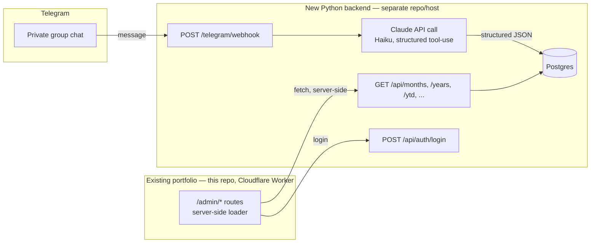

# Finance tracker — investigation & roadmap

> Status: **investigation, not started**. This is a planning doc, not a spec —
> expect it to change once Phase 0 starts turning assumptions into real code.
> Lives here (not `TECH-DEBT.md`) because it's a separate system with its own
> repo, hosting, and database — this file just documents how it connects to
> the CV site.

## 1. What this is

A private, two-person household finance tracker, bolted onto the existing CV
site as a read-only `/admin` section. The point of building it is **learning**
— Python, FastAPI, SQL, and Claude API / prompt engineering — not shipping
the fastest possible MVP. The roadmap below is paced accordingly: each phase
ends with something real running before the next one starts.

**Explicitly a secondary goal for you and your girlfriend to use day to day**
— if the learning goal and the "actually useful" goal ever pull in different
directions (e.g. a quick hack vs. the "proper" way), default to whichever one
you're trying to practice, since that's the reason this project exists.

### Decided already (from the kickoff conversation)

| Decision          | Choice                      | Why                                                                                                                                                                                                                                                                                                                                                                  |
| ----------------- | --------------------------- | -------------------------------------------------------------------------------------------------------------------------------------------------------------------------------------------------------------------------------------------------------------------------------------------------------------------------------------------------------------------- |
| Messaging channel | **Telegram**, not WhatsApp  | Telegram's Bot API is official, free, and reads group messages natively. WhatsApp's official Cloud API doesn't reliably support reading group chats — only unofficial, ToS-violating libraries do (see §4.1).                                                                                                                                                        |
| CV data           | **Stays exactly as-is**     | The current static-JSON, edge-cached setup (§9 of `AGENTS.md`) is deliberately tuned to be fast and free with zero external calls. Migrating it into a new backend would add latency, cost, and a new failure mode to a page that needs none of that. Finance is a fully separate system that happens to share your Cloudflare account and (optionally) a subdomain. |
| Hosting budget    | **Free tier only**, for now | Achievable end-to-end (§8). Trade-off is cold-start latency after idle — fine for a tool checked a few times a month.                                                                                                                                                                                                                                                |
| Admin login       | **One shared password**     | Simplest option for two trusted people. Still gets hashed + sessioned properly (§6.5) — "simple" isn't an excuse to skip the basics.                                                                                                                                                                                                                                 |

### Non-goals for v1

- Multi-currency (assume one currency; see open question in §10).
- Budgets, alerts, forecasting.
- Receipt photo OCR (Claude vision could do this later — stretch goal).
- Any write UI in the frontend — corrections happen via Telegram (§6.6), not
  a form on the site. This keeps the frontend genuinely read-only, per your
  original spec.
- Migrating the CV's own data into this backend (see table above).

---

## 2. Architecture at a glance



Two independent deployables:

1. **This repo** (unchanged deployment model) gains a handful of new
   `/admin/*` routes. Their loaders run server-side in the Cloudflare Worker
   and call the new backend over plain HTTPS — **not** from the browser. That
   sidesteps CORS and CSP entirely; it's the same pattern every existing
   route already uses (loader fetches data, renders server-side), just
   fetching from an external API instead of a local JSON import.
2. **A new backend repo** — Python + FastAPI, its own host, its own
   Postgres database, deployed independently of the CV site.

The two only talk over HTTP(S). Nothing here needs the two to be in the same
repo, language, or deploy pipeline.

---

## 3. Why this shape (answering the brief point by point)

- **§1 Frontend security/login** — see §6.5. Shared password, hashed,
  session cookie, loader-level gate on `/admin/*`.
- **§2/§3 Month-by-month, yearly review, YTD** — see §7 for the concrete
  endpoint list and what each view needs.
- **§4 Frontend gets static, tailored data; backend does the heavy lifting**
  — yes: the backend pre-aggregates (sums, category breakdowns) so the
  frontend loaders do a simple `fetch` + render, no client-side number
  crunching. Matches how `getSkillHeatmapData` etc. already precompute once
  server-side rather than in components.
- **§5 Python + FastAPI backend** — see §5.
- **§6 Several endpoints for data delivery** — see §7.
- **§7 WhatsApp group feasibility** — investigated in §4.1; the answer is
  "not cleanly possible while keeping it a group chat," which is why the
  channel decision above landed on Telegram.
- **§8 Read-only site, all writes via chat → Claude → backend → DB** — this
  is the architecture in §2, exactly as specified.
- **§9 Costs** — see §8.

---

## 4. Ingestion: Telegram + Claude

### 4.1 Why not WhatsApp (the investigation)

WhatsApp has two integration paths, and neither fits "read a real group chat
for free, safely":

- **Official WhatsApp Business Cloud API (Meta)** — ToS-compliant, has a
  free tier for the message volumes this needs, but is built around 1:1
  business conversations. Reliable, supported reading of **group** messages
  isn't part of the official product. You could still use it as a bot both
  of you DM directly — no group feel, but fully legitimate.
- **Unofficial automation (e.g. Baileys, whatsapp-web.js)** — drives a real
  WhatsApp Web session programmatically, so it _can_ read an actual group.
  But it violates WhatsApp's Terms of Service, risks the phone number being
  banned, and needs an always-on process holding a live session — not
  something you can run as a simple serverless function on a free tier.

**Telegram sidesteps the whole problem.** Its Bot API is official, free, has
no group restriction, and a bot can read every message in a group it's
added to (after disabling "privacy mode" for that bot in @BotFather — off by
default, one settings toggle). This is the only path that gets you an actual
shared group chat without ToS risk.

### 4.2 Ingestion flow

1. Create a bot via [@BotFather](https://t.me/BotFather) (free, instant),
   disable privacy mode so it sees all group messages, not just `/commands`.
2. Add the bot to a private group with just the two of you.
3. Point the bot's webhook at `POST /telegram/webhook` on the new backend,
   set with Telegram's `setWebhook` call including a `secret_token` — the
   backend rejects any request whose header doesn't match, so the endpoint
   isn't just security-through-obscurity.
4. The backend forwards the raw message text to Claude with a system prompt
   describing the expense schema, using **Claude's tool-use / forced-schema
   output** (define an `record_expense` tool with a strict JSON schema —
   amount, category, description, paid_by, occurred_on) rather than asking
   for free-text JSON and hoping it parses. This is the reliable way to get
   structured output from a model and is worth learning as a pattern
   regardless of this project.
5. Model recommendation: **Haiku-class** (`claude-haiku-4-5-20251001` as of
   this doc). This is simple structured extraction from a short message —
   Haiku is the cost-optimized tier for exactly this kind of task; reach for
   a bigger model only if extraction accuracy turns out to need it.
6. Validate the model's output against the same schema server-side (never
   trust a model's output blindly, even with tool-use), then write to
   Postgres — keep the **original raw message text** alongside the parsed
   row for audit/debugging when the model gets something wrong.

> **Pricing note:** don't trust this doc's memory of exact per-token prices —
> model lineups and pricing shift. When you get to Phase 4, use the
> `claude-api` skill (already available in this environment) to pull current
> model IDs and pricing before committing to one. At the message volume a
> two-person household generates (a handful of short messages a day), the
> realistic cost is low enough that it's a rounding error either way — but
> confirm that with real numbers, not this paragraph.

### 4.3 Corrections without a write UI

Since the frontend stays read-only, mistakes get fixed one of two ways:

- A Telegram command handled by the same webhook — e.g. `/undo` (delete the
  last parsed entry) or `/edit last category=groceries`. Small, useful, and
  good FastAPI-routing practice.
- Direct SQL against the database for anything the bot doesn't handle — this
  doubles as SQL practice, so treat it as a feature of the plan, not a gap.

---

## 5. Backend: Python + FastAPI

New, separate repo. Suggested shape (standard FastAPI project layout, nothing
exotic):

```text
finance-tracker-backend/
├── app/
│   ├── main.py              # FastAPI() app, router includes
│   ├── routers/
│   │   ├── auth.py
│   │   ├── telegram.py      # webhook receiver
│   │   └── expenses.py      # month/year/ytd/categories
│   ├── models.py            # SQLAlchemy models
│   ├── schemas.py           # Pydantic request/response schemas
│   ├── claude.py            # Claude API call + tool-use schema
│   ├── db.py                # engine/session setup
│   └── config.py            # env-based settings (pydantic-settings)
├── alembic/                 # migrations
├── tests/                   # pytest
├── pyproject.toml
└── Dockerfile               # most free hosts want a container or a
                              # buildpack-detectable app; a Dockerfile keeps
                              # you portable across providers
```

Tooling choices, matching the learning goal:

- **uv** or **poetry** for dependency management (either is fine; `uv` is
  newer and fast, worth trying if you haven't).
- **SQLAlchemy 2.x + Alembic** for models/migrations — but write the initial
  schema as raw SQL first (§6.2), _then_ express it in SQLAlchemy, so the
  ORM doesn't hide what's actually happening in the database.
- **pytest** for tests, mirroring the discipline this repo already has.
- **pydantic-settings** for config (`DATABASE_URL`, `CLAUDE_API_KEY`,
  `TELEGRAM_BOT_TOKEN`, `TELEGRAM_WEBHOOK_SECRET`, `ADMIN_PASSWORD_HASH`) —
  never commit real values; same `.env`-not-in-git discipline as this repo's
  `.dev.vars`.

---

## 6. Frontend: `/admin` section in this repo

### 6.1 Routes (flat-route convention, matching existing `app/routes/`)

| Route                                           | Purpose                                               |
| ----------------------------------------------- | ----------------------------------------------------- |
| `admin._index/` → `/admin`                      | Login form                                            |
| `admin.dashboard/` → `/admin/dashboard`         | Current month view (default landing page after login) |
| `admin.month.$yyyyMm/` → `/admin/month/:yyyyMm` | A specific month                                      |
| `admin.year.$year/` → `/admin/year/:year`       | Yearly review for a given year                        |

### 6.2 Data flow

Every `/admin/*` loader runs server-side (same Worker, same pattern as every
existing route) and does a plain `fetch()` to the backend's API using a
service-level credential — the browser never talks to the backend directly,
so there's no CORS, no new `connect-src` CSP entry, and no extra client-side
JS. This is the single biggest simplification available here: reuse the
exact "loader fetches, component renders" shape the whole site already uses.

### 6.3 Visual ideas worth reusing

- The **tenure heatmap** (`app/components/TenureHeatmap/`) is a GitHub-style
  year × period grid — the same shape works nicely for "spending intensity
  by month" or "category × month." Worth adapting rather than building a new
  chart component from scratch.
- `Card` and the existing design tokens (`app/styles/constants.js`) should
  cover the month/year summary tiles without new components.

### 6.4 Keep it out of public surfaces

- Don't add `/admin` to `NavBar`'s `MAIN_NAV` — reachable only by direct URL
  plus the login gate. (This mirrors how routes are already deliberately
  left out of the nav when there's no reason to advertise them.)
- Add `/admin*` to `robots.txt` disallow, and stamp `X-Robots-Tag: noindex`
  on admin responses in `workers/app.ts`, matching the existing pattern
  already used for `.data` endpoints in this file.

### 6.5 Auth (shared password)

- Backend hashes the one shared password (e.g. `passlib`/`bcrypt`) — even
  for two people, a password is never stored in plaintext, no exceptions.
- `POST /api/auth/login` checks the password, issues a signed session token
  (JWT, short-lived, HS256 with a shared secret).
- The Worker can **verify the JWT's signature locally** (same secret,
  no network round-trip) before even calling the backend for data — cheap,
  and keeps the admin-gate check fast.
- Session cookie: `HttpOnly`, `Secure`, `SameSite=Lax`, similar to the
  `locale` cookie already set by `LocaleToggle`.

> **Optional extra layer, not required:** Cloudflare Access (part of Zero
> Trust, free for small user counts) could gate the whole thing with
> email-based one-time-PIN login restricted to your two addresses, with zero
> custom auth code. Worth knowing about even though the shared-password
> approach above is what was chosen — nothing stops using both (defense in
> depth) later.

### 6.6 What each page needs from the API

- **Month view** — total spent, breakdown by category, list of individual
  transactions for that month.
- **Year view** — total for the year, month-by-month totals (for the
  heatmap-style chart), category breakdown, optionally compared to the
  previous year.
- **YTD** — same shape as year view, but bounded at "today" instead of
  Dec 31, plus maybe a simple "on pace for ~X by year end" projection later
  (stretch goal, not v1).

---

## 7. Endpoints (concrete v1 list)

| Method + path               | Purpose                                                   | Auth                           |
| --------------------------- | --------------------------------------------------------- | ------------------------------ |
| `POST /telegram/webhook`    | Receives Telegram updates                                 | Telegram `secret_token` header |
| `POST /api/auth/login`      | Password → session JWT                                    | none (this _is_ the login)     |
| `GET /api/months/{yyyy-mm}` | Total, category breakdown, transaction list for one month | session                        |
| `GET /api/years/{yyyy}`     | Total, per-month totals, category breakdown for a year    | session                        |
| `GET /api/ytd`              | Same shape as `/years`, bounded at today                  | session                        |
| `GET /api/categories`       | Category list (for chart legends/filters)                 | session                        |
| `GET /api/health`           | Liveness check for the hosting provider                   | none                           |

All the `GET` endpoints return **pre-aggregated** JSON — sums and groupings
computed in SQL/Python server-side, not raw rows for the frontend to crunch.

---

## 8. Costs (investigation, not a quote)

Every number below is a **provider's advertised tier as of this doc's
writing** — free-tier terms change often. Re-verify at signup, and treat
this table as "which category of thing to look at," not a guarantee.

| Piece           | Option                                | Notes                                                                                                                                                                                                                                                                                                              |
| --------------- | ------------------------------------- | ------------------------------------------------------------------------------------------------------------------------------------------------------------------------------------------------------------------------------------------------------------------------------------------------------------------ |
| Messaging       | Telegram Bot API                      | Free, no tier to worry about.                                                                                                                                                                                                                                                                                      |
| AI parsing      | Claude API (Haiku-class)              | Pay-per-token, but at "a few short messages a day" volume this is negligible — get real numbers via the `claude-api` skill before Phase 4.                                                                                                                                                                         |
| Backend hosting | Render / Fly.io free web-service tier | Free tiers on these exist but commonly **spin down after ~15 min idle**, adding a few seconds of cold-start on the next request. Fine for a tool checked occasionally; confirm current terms, since these have shifted before (e.g. Railway moved away from an indefinite free tier to trial credit + paid plans). |
| Database        | Neon or Supabase free Postgres        | Both offer a genuinely free tier at this scale (serverless Postgres, scale-to-zero / pause-on-idle). Either is a reasonable, real-SQL choice — Neon leans more "just Postgres," Supabase bundles extras (auth, storage) you won't need here.                                                                       |
| Domain          | Subdomain of the existing domain      | Free — you already own `gonzalo-alvarez-campos-cv.com` on Cloudflare; something like `finance-api.gonzalo-alvarez-campos-cv.com` costs nothing extra and optionally sits behind Cloudflare's proxy for free TLS + basic protection in front of the Python backend.                                                 |

**Realistic total: $0/month**, with cold-start latency after idle as the
one real trade-off — a non-issue for a dashboard checked a handful of times
a month.

---

## 9. Phased roadmap

Each phase should end with something concretely running before starting the
next one — that's the point, given the learning goal.

- **Phase 0 — Scaffolding.** New repo, FastAPI "hello world," deployed to
  the chosen free host, publicly reachable. Get the deploy loop working
  before any real logic exists.
- **Phase 1 — Database & schema.** Provision Postgres (Neon/Supabase).
  Write the schema as raw SQL DDL first, query it by hand via `psql` or the
  provider's console, _then_ express the same schema in SQLAlchemy models +
  an Alembic migration, so the ORM layer never hides what the SQL actually
  does.
- **Phase 2 — Core read endpoints.** Implement `/api/months`, `/api/years`,
  `/api/ytd`, `/api/categories` against seeded fake data. Use FastAPI's free
  `/docs` (OpenAPI) as you go. Write pytest tests alongside, matching this
  repo's existing testing discipline.
- **Phase 3 — Telegram plumbing.** Create the bot, wire the webhook, and
  for this phase just **log the raw incoming message** — no Claude yet.
  Confirm the full chain (group → webhook → backend log) works before
  adding AI on top of it.
- **Phase 4 — Claude integration.** Add the tool-use call, test against a
  batch of real example messages the two of you might actually send, and
  iterate on the prompt/schema until extraction is reliably accurate. Store
  results, keep the raw text alongside.
- **Phase 5 — Auth.** Shared-password login, hashing, session issuance.
- **Phase 6 — Frontend admin UI (this repo).** Add the `/admin/*` routes,
  wire loaders to the now-real backend, build the month/year/YTD views.
- **Phase 7 — Hardening.** Rate limiting on the backend (e.g. `slowapi`),
  confirm the webhook's secret-token check, basic logging/observability,
  put the backend behind the Cloudflare-proxied subdomain, and do a real
  cost check-in against §8's estimates.

**Stretch goals (explicitly deferred, not forgotten):** receipt-photo OCR
via Claude's vision capability, multi-currency, budgets/alerts, a `/undo`
or `/edit` Telegram command (pull forward into Phase 4 if corrections turn
out to be frequent), push notifications, revisiting the CV-data-migration
question from §1 if a concrete reason for it ever shows up.

---

## 10. Open questions for Phase 0/1 (small, deliberately deferred)

These don't need answers to start Phase 0 — they matter once the schema
gets designed in Phase 1:

- **Currency**: assume a single currency (ARS?) for v1 — confirm before
  writing the schema, since adding multi-currency later means a migration.
- **Category taxonomy**: define the actual list together (groceries,
  rent/expensas, utilities, transport, etc.) before Phase 1's schema design.
- **Retention**: keep raw Telegram message text indefinitely alongside
  parsed rows? (Recommended: yes — cheap, and useful for debugging any
  low-confidence Claude parse.)

---

## 11. Next step

Pick Phase 0 when you're ready to start: a new repo, a FastAPI "hello
world," deployed and publicly reachable on whichever free host you land on
after a quick look at current terms. Everything past that point should get
its own, much more detailed, working session rather than more planning.
